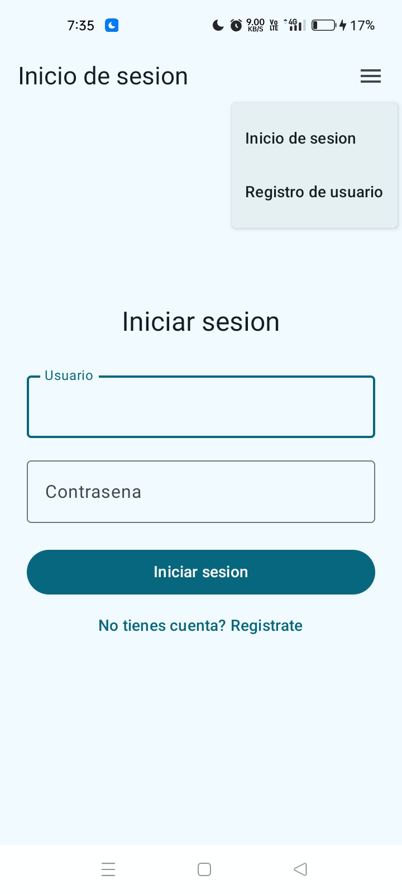
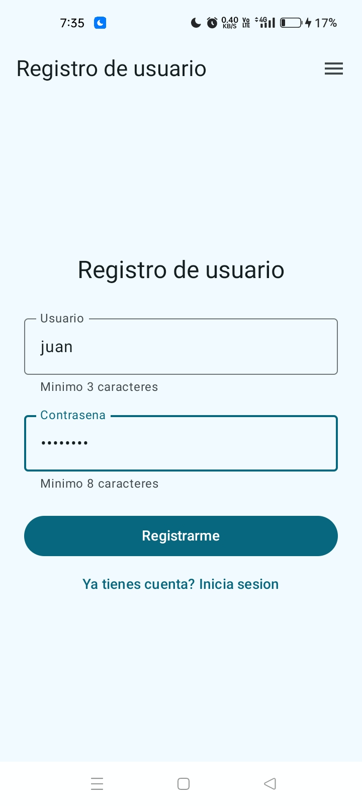
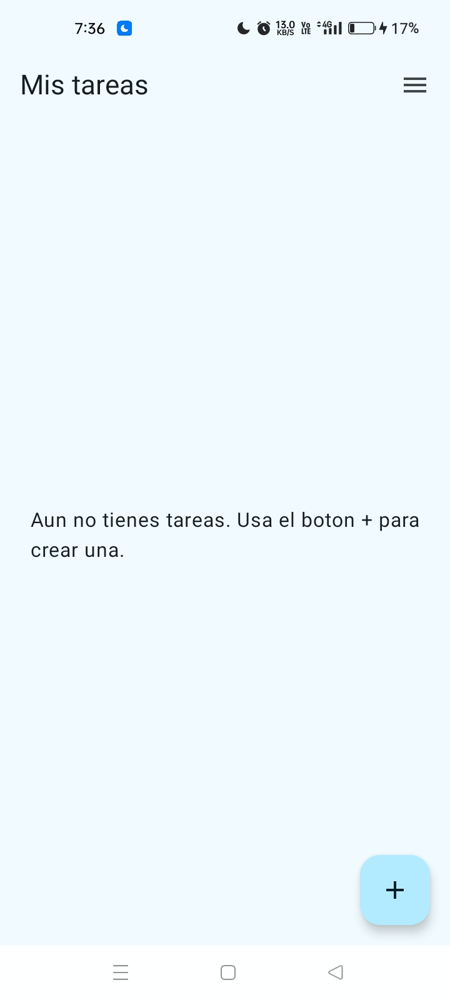
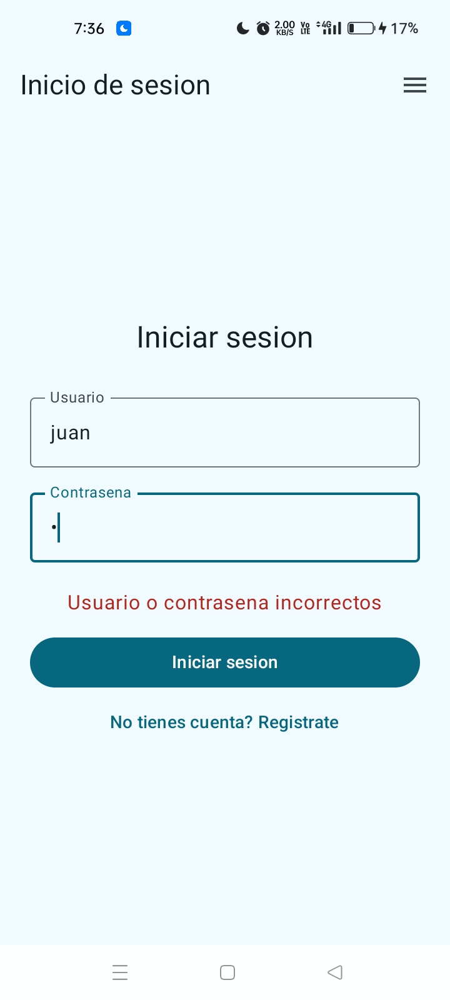
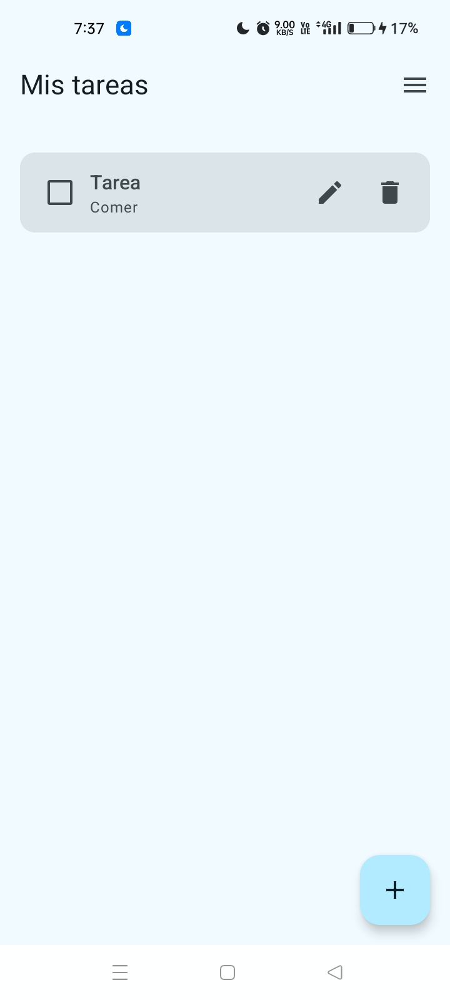
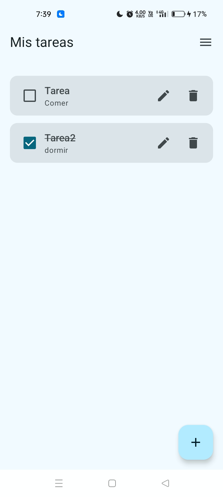
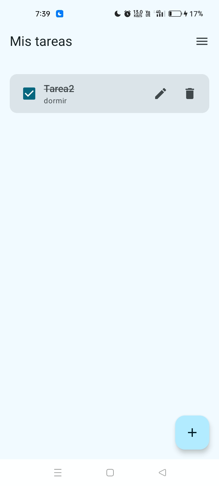

# Practica 2 — Aplicacion movil basica para operaciones CRUD con un servicio REST

## Portada

- **Nombre completo:** Jesús Ángel González Arellano
- **Número de boleta:** 2022630690
- **Grupo:** 7CV4
- **Asignatura:** Desarrollo de aplicaciones móviles nativas
- **Profesor(a):** Gabriel Hurtado Avilés
- **Fecha de entrega:** 18 de septiembre de 2026

---

## Introduccion

Esta practica consiste en una aplicacion movil Android (Kotlin + Jetpack Compose)
que consume un servicio REST propio para autenticar usuarios y administrar un
recurso de **Tareas** mediante las cuatro operaciones CRUD (crear, leer, actualizar,
borrar). El objetivo es demostrar el ciclo completo cliente-servidor: una app movil
real hablando con un backend dockerizado, con contrasenas hasheadas y sesiones
protegidas por JWT.

### Stack elegido y justificacion

| Componente        | Eleccion                                   | Justificacion |
|--------------------|---------------------------------------------|----------------|
| Backend            | **FastAPI** (Python 3.12)                   | El enunciado permite elegir libremente el lenguaje y framework del backend, siempre que se justifique. Se eligio FastAPI por su tipado con Pydantic (validacion de datos de entrada en tiempo de ejecucion, con errores 422 automaticos ante datos malformados), generacion automatica de documentacion interactiva (`/docs`) que facilita probar los endpoints, y soporte nativo de `async`/`await` para manejar peticiones HTTP de forma eficiente. |
| ORM                 | **SQLModel** (sobre SQLAlchemy 2.0)         | Combina la validacion de Pydantic con el mapeo objeto-relacional de SQLAlchemy en una sola clase de modelo, reduciendo codigo duplicado entre el esquema de la base de datos y el esquema de la API, y evitando escribir SQL a mano (con el beneficio adicional de prevenir inyeccion SQL mediante consultas parametrizadas). |
| Base de datos       | **PostgreSQL 17** (dockerizado)             | Motor relacional cliente-servidor robusto, con soporte maduro para transacciones y conexiones concurrentes; se dockerizo como un servicio independiente en `docker-compose.yml` (basado en el archivo `comandos_docker.txt` provisto para la practica), separado del backend pero conectado a el por una red interna de Docker, tal como exige el enunciado para el manejo de la persistencia. |
| Hash de contrasenas | **Argon2** (`argon2-cffi`)                   | Ganador del Password Hashing Competition (2015); resistente a ataques por fuerza bruta acelerados por GPU/ASIC gracias a su costo de memoria configurable. Cumple directamente el requisito de "funcion de hash con sal" del enunciado. |
| Sesiones            | **JWT firmado** (`PyJWT`, HS256) con expiracion | Token stateless que el backend puede validar sin consultar una tabla de sesiones en cada peticion; firmado con un secreto que nunca se sube al repositorio (`JWT_SECRET` por variable de entorno) y con expiracion configurable para limitar el tiempo de validez de una sesion robada. |
| App movil           | **Kotlin + Jetpack Compose (Material 3)**   | Requerido por el enunciado; Compose permite describir la interfaz de forma declarativa directamente en Kotlin, reduciendo la cantidad de codigo necesario para las 4 pantallas de la practica frente a un enfoque imperativo. |
| Cliente HTTP        | **Retrofit + OkHttp**                        | Cliente HTTP estandar en el ecosistema Android; permite declarar los endpoints del backend como una interfaz de Kotlin y agregar un interceptor que inyecta automaticamente el token JWT en cada peticion protegida. |

### Autoria del codigo

Todo el codigo de esta entrega es propio: el backend (`backend/`) se construyo desde
cero en FastAPI + PostgreSQL, y la app Android (`android/TareasApp/`) se genero con
Android Studio y se desarrollo completa desde ahi — capa de red (`data/remote/`),
repositorios (`data/repository/`), persistencia de sesion (`data/local/`), ViewModels
(`viewmodel/`), navegacion (`ui/navigation/`) y las 4 pantallas (`ui/screens/login`,
`ui/screens/register`, `ui/screens/tareas`).

---

## Desarrollo

### Conceptos del Ejercicio 2 (con palabras propias)

- **Docker**: una herramienta que permite empaquetar una aplicacion junto con
  todo lo que necesita para correr (interprete, librerias, variables de
  configuracion) dentro de una unidad aislada llamada *contenedor*. A diferencia
  de una maquina virtual, un contenedor no simula hardware ni carga un sistema
  operativo completo: reutiliza el nucleo (kernel) del sistema anfitrion, por eso
  arranca en segundos en vez de minutos. La gran ventaja practica es la
  **reproducibilidad**: si el proyecto corre en un contenedor en mi maquina,
  corre igual en la maquina de un companero o en un servidor en la nube, porque
  las dependencias exactas viajan con el codigo.
- **Imagen y contenedor**: la *imagen* es una plantilla de solo lectura (como una
  "foto congelada" del sistema de archivos de la app) construida a partir de un
  `Dockerfile`. El *contenedor* es una instancia en ejecucion de esa imagen: se
  le puede iniciar, detener o borrar, y por defecto es efimero (si se borra el
  contenedor, se pierde cualquier dato escrito dentro de el que no este en un
  volumen). Por eso Postgres usa un *volumen* (`./data:/var/lib/postgresql/data`)
  para que la base de datos sobreviva aunque el contenedor se recree.
- **Dockerfile**: un archivo de texto con instrucciones que Docker ejecuta en
  orden para construir la imagen: `FROM` define la imagen base, `WORKDIR` fija el
  directorio de trabajo dentro del contenedor, `COPY` copia archivos del host a
  la imagen, `RUN` ejecuta comandos durante la construccion (por ejemplo,
  instalar dependencias), `EXPOSE` documenta el puerto que la app usa dentro del
  contenedor, y `CMD` define el comando que se ejecuta cuando arranca el
  contenedor.
- **docker-compose.yml**: un archivo YAML que describe la aplicacion completa
  como un conjunto de *servicios* relacionados (en este caso, `backend` y
  `postgres`), especificando para cada uno la imagen o el Dockerfile a construir,
  los puertos publicados, los volumenes, las variables de entorno y las
  dependencias entre servicios (`depends_on`). Con un solo comando
  (`docker compose up --build`) se construyen las imagenes necesarias y se
  levantan todos los contenedores conectados entre si en una red privada.
- **Backend o servicio REST**: el programa que corre del lado del servidor,
  expone rutas HTTP (por ejemplo `/auth/login`, `/tareas`) y responde a los
  verbos `GET`, `POST`, `PUT` y `DELETE` segun la accion solicitada. Recibe la
  peticion, valida los datos de entrada, interactua con la base de datos, y
  responde en formato JSON junto con un codigo de estado HTTP que indica el
  resultado (exito, error del cliente, error de autenticacion, etc.).
- **ORM y base de datos**: un ORM (Object-Relational Mapper), como SQLAlchemy
  (usado internamente por SQLModel), permite trabajar con las tablas de la base
  de datos como si fueran clases y objetos del lenguaje de programacion, sin
  escribir sentencias SQL a mano. Esto reduce errores de sintaxis SQL y ayuda a
  prevenir inyeccion SQL, porque el ORM parametriza las consultas
  automaticamente. En esta practica la base de datos es PostgreSQL, un motor
  relacional robusto que corre como su propio servicio dockerizado.

### Arquitectura

```
Practica2/
├── backend/                     # API REST en FastAPI
│   ├── app/
│   │   ├── main.py              # Punto de entrada FastAPI
│   │   ├── database.py          # Engine SQLModel / conexion a Postgres
│   │   ├── models.py            # Modelos User y Tarea
│   │   ├── schemas.py           # Esquemas Pydantic (request/response)
│   │   ├── security.py          # Hash Argon2, JWT, dependencia get_current_user
│   │   └── routers/
│   │       ├── auth.py          # POST /auth/register, POST /auth/login
│   │       └── tareas.py        # CRUD /tareas (protegido por JWT)
│   ├── requirements.txt
│   ├── Dockerfile
│   ├── docker-compose.yml       # Servicios: postgres + backend
│   ├── .env.example
│   └── .gitignore
├── android/TareasApp/            # App Android (Kotlin + Jetpack Compose)
│   └── app/src/main/java/com/practica2/tareasapp/
│       ├── data/remote/          # Retrofit, ApiService, DTOs, interceptor JWT
│       ├── data/local/           # SessionDataStore (persistencia del token)
│       ├── data/repository/      # AuthRepository, TareasRepository
│       ├── viewmodel/            # LoginViewModel, RegisterViewModel, TareasViewModel, SessionViewModel
│       ├── ui/navigation/        # NavGraph + rutas
│       ├── ui/components/        # Menu de navegacion (AppScaffold)
│       └── ui/screens/           # LoginScreen, RegisterScreen, TareasListScreen, TareaFormScreen
├── imagenes/                     # Capturas de pantalla del flujo probado
├── CLAUDE.md                     # Checklist de cumplimiento de la practica
└── README.md                     # Este archivo
```

### Documentacion de endpoints

Base URL local (backend dockerizado): `http://localhost:8000` (o
`http://<IP_LOCAL>:8000` desde un dispositivo fisico en la misma red).

#### `GET /` — Health check

| | |
|---|---|
| Autenticacion | No requerida |
| Respuesta 200 | `{"status": "ok", "service": "practica2-tareas-api"}` |

#### `POST /auth/register` — Registrar usuario

| | |
|---|---|
| Autenticacion | No requerida |
| Body (JSON) | `{"username": "jesus", "password": "SuperSecreta123"}` |
| Respuesta 201 | `{"id": 1, "username": "jesus", "created_at": "2026-09-10T21:49:54.426618"}` |
| Respuesta 400 | `{"detail": "El usuario ya existe"}` |

#### `POST /auth/login` — Iniciar sesion

| | |
|---|---|
| Autenticacion | No requerida |
| Body (JSON) | `{"username": "jesus", "password": "SuperSecreta123"}` |
| Respuesta 200 | `{"access_token": "eyJhbGciOi...", "token_type": "bearer", "expires_in": 3600}` |
| Respuesta 401 | `{"detail": "Usuario o contrasena incorrectos"}` |

#### `GET /tareas` — Listar tareas del usuario autenticado

| | |
|---|---|
| Autenticacion | `Authorization: Bearer <token>` |
| Respuesta 200 | `[{"id": 1, "titulo": "Terminar practica 2", "descripcion": "Backend+Android", "completada": false, "owner_id": 1, "created_at": "...", "updated_at": "..."}]` |
| Respuesta 401 | `{"detail": "No hay una sesion valida (token ausente, invalido o expirado)"}` |

#### `GET /tareas/{id}` — Obtener una tarea

| | |
|---|---|
| Autenticacion | `Authorization: Bearer <token>` |
| Parametros | `id` (int, path) |
| Respuesta 200 | `{"id": 1, "titulo": "...", ...}` |
| Respuesta 404 | `{"detail": "Tarea no encontrada"}` (no existe o pertenece a otro usuario) |

#### `POST /tareas` — Crear tarea

| | |
|---|---|
| Autenticacion | `Authorization: Bearer <token>` |
| Body (JSON) | `{"titulo": "Terminar practica 2", "descripcion": "Backend+Android", "completada": false}` |
| Respuesta 201 | `{"id": 1, "titulo": "Terminar practica 2", "descripcion": "Backend+Android", "completada": false, "owner_id": 1, "created_at": "...", "updated_at": "..."}` |
| Respuesta 401 | Sin token valido |

#### `PUT /tareas/{id}` — Actualizar tarea

| | |
|---|---|
| Autenticacion | `Authorization: Bearer <token>` |
| Parametros | `id` (int, path) |
| Body (JSON) | `{"completada": true}` (campos parciales; solo se actualiza lo enviado) |
| Respuesta 200 | Tarea actualizada completa |
| Respuesta 400 | `{"detail": "No se recibio ningun campo para actualizar"}` |
| Respuesta 404 | `{"detail": "Tarea no encontrada"}` |

#### `DELETE /tareas/{id}` — Borrar tarea

| | |
|---|---|
| Autenticacion | `Authorization: Bearer <token>` |
| Parametros | `id` (int, path) |
| Respuesta 200 | `{"detail": "Tarea eliminada correctamente", "id": 1}` |
| Respuesta 404 | `{"detail": "Tarea no encontrada"}` |

Todos los endpoints validados manualmente con `curl` durante el desarrollo,
cubriendo los 5 codigos de estado exigidos por el enunciado: **200, 201, 400,
401, 404**.

### Instalacion y ejecucion — Backend

Requisito: tener Docker y Docker Compose instalados (nada mas).

```bash
git clone <URL_DEL_REPOSITORIO>
cd <repo>/backend
cp .env.example .env
# Editar .env: cambiar POSTGRES_PASSWORD y, sobre todo, JWT_SECRET por un
# valor aleatorio y largo, por ejemplo:
#   python3 -c "import secrets; print(secrets.token_hex(32))"
docker compose up --build
```

Esto construye la imagen del backend (`Dockerfile`), descarga la imagen oficial
de `postgres:17`, y levanta ambos servicios conectados por una red interna de
Docker. El backend queda expuesto en `http://localhost:8000` (documentacion
interactiva automatica en `http://localhost:8000/docs`). Postgres persiste sus
datos en `backend/data/` (bind mount), por lo que la informacion sobrevive a
`docker compose down` (no a `docker compose down -v`, que borra tambien el
volumen).

Verificacion rapida:

```bash
curl http://localhost:8000/
```

### Instalacion y ejecucion — App Android

1. Abrir la carpeta `android/TareasApp/` en Android Studio.
2. Editar `app/src/main/java/com/practica2/tareasapp/data/remote/ApiConfig.kt`
   y cambiar `BASE_URL` por la IP local del equipo donde corre el backend
   (obtenerla con `ip addr` en Linux/Mac o `ipconfig` en Windows), por ejemplo
   `"http://192.168.1.100:8000/"`. **Importante:** el dispositivo fisico debe
   estar en la misma red Wi-Fi que ese equipo, y el firewall debe permitir
   conexiones entrantes al puerto 8000.
   - Nota: si en cambio se prueba en el emulador de Android Studio, la
     direccion correcta es `http://10.0.2.2:8000/`, ya que `localhost` desde el
     emulador apunta al propio emulador y no al equipo anfitrion.
3. Conectar el dispositivo fisico por USB (con depuracion USB activada) o por
   ADB inalambrico, y ejecutar la app desde Android Studio (Run ▶), o generar
   el APK con `./gradlew assembleDebug` e instalarlo manualmente
   (`adb install app/build/outputs/apk/debug/app-debug.apk`).
4. El flujo esperado: pantalla de Login → boton "Registrate" si no se tiene
   cuenta → tras iniciar sesion, pantalla de Tareas con boton `+` para crear,
   casilla para marcar como completada, e iconos de editar/borrar por tarea.

### Seguridad — QA documentado

- **Contrasenas**: nunca se almacenan ni se registran (logs) en texto plano;
  se hashean con Argon2 (`backend/app/security.py`) antes de guardarse en la
  base de datos. Verificado inspeccionando manualmente el contenido de la tabla
  `user` (columna `hashed_password` contiene solo el hash Argon2, nunca la
  contrasena original).
- **Sesiones**: cada login exitoso emite un JWT firmado con `JWT_SECRET`
  (HS256) y expiracion configurable (`JWT_EXPIRE_MINUTES`, por defecto 60
  minutos). El backend valida firma y expiracion en cada request a un endpoint
  protegido (`get_current_user`), y responde `401` si el token falta, es
  invalido o expiro — verificado con `curl` sin header `Authorization` y con un
  token invalido a proposito.
- **Aislamiento de datos**: cada tarea pertenece a un `owner_id`; un usuario
  nunca puede leer, editar o borrar tareas de otro usuario (se responde `404`
  en vez de `403` para no filtrar si el recurso existe).
- **Secretos fuera del repositorio**: `backend/.env` esta en `.gitignore`; solo
  se publica `backend/.env.example` con los nombres de las variables, sin
  valores reales.
- **Trafico en desarrollo**: la app usa `usesCleartextTraffic="true"` porque el
  backend no tiene TLS en este entorno de desarrollo local; queda documentado
  como decision tecnica explicita, no como descuido.

### Capturas de pantalla

Flujo completo probado en un dispositivo Android físico, conectado al backend
dockerizado por red local.

**Menú de navegación**



**Registro de usuario**



**Inicio de sesión**



**Inicio de sesión con credenciales incorrectas**



**Crear tarea**



**Listar tareas**


**Actualizar tarea**



**Borrar tarea**



---

## Conclusiones

- **Retos**: construir el backend completo desde cero (autenticacion,
  autorizacion por token y CRUD protegido) y coordinar el manejo de sesion del
  lado de la app Android (persistencia del token, interceptor automatico de
  autorizacion, deteccion de sesion expirada) fueron las partes que requirieron
  mas piezas trabajando en conjunto.
- **Logros**: las cuatro operaciones CRUD, el registro y el inicio de sesion
  quedaron funcionando de extremo a extremo — probados primero con `curl`
  cubriendo los codigos 200/201/400/401/404, y despues con la app real
  corriendo en un dispositivo Android fisico conectado al backend dockerizado.
- **Dificultades y solucion**: para probar la app en un dispositivo fisico fue
  necesario identificar la IP local correcta del equipo donde corre el backend
  (en vez de usar `localhost`, que no aplica desde otro dispositivo) y
  confirmar que ambos estuvieran en la misma red antes de que la conexion
  funcionara.

---

## Bibliografia

FastAPI. (2026). *FastAPI documentation*. https://fastapi.tiangolo.com/

SQLModel. (2026). *SQLModel documentation*. https://sqlmodel.tiangolo.com/

The PostgreSQL Global Development Group. (2026). *PostgreSQL 17 documentation*.
https://www.postgresql.org/docs/17/

Docker Inc. (2026). *Docker documentation*. https://docs.docker.com/

Docker Inc. (2026). *Compose file reference*.
https://docs.docker.com/compose/compose-file/

PyJWT. (2026). *PyJWT documentation*. https://pyjwt.readthedocs.io/

Biryukov, A., Dinu, D., & Khovratovich, D. (2016). *Argon2: the memory-hard
function for password hashing and other applications* (RFC 9106).
https://www.rfc-editor.org/rfc/rfc9106

OWASP Foundation. (2026). *Password storage cheat sheet*.
https://cheatsheetseries.owasp.org/cheatsheets/Password_Storage_Cheat_Sheet.html

Google. (2026). *Jetpack Compose documentation*.
https://developer.android.com/develop/ui/compose/documentation

Google. (2026). *Navigation with Compose*.
https://developer.android.com/develop/ui/compose/navigation

Square Inc. (2026). *Retrofit documentation*. https://square.github.io/retrofit/

Square Inc. (2026). *OkHttp documentation*. https://square.github.io/okhttp/

Google. (2026). *DataStore documentation*.
https://developer.android.com/topic/libraries/architecture/datastore
